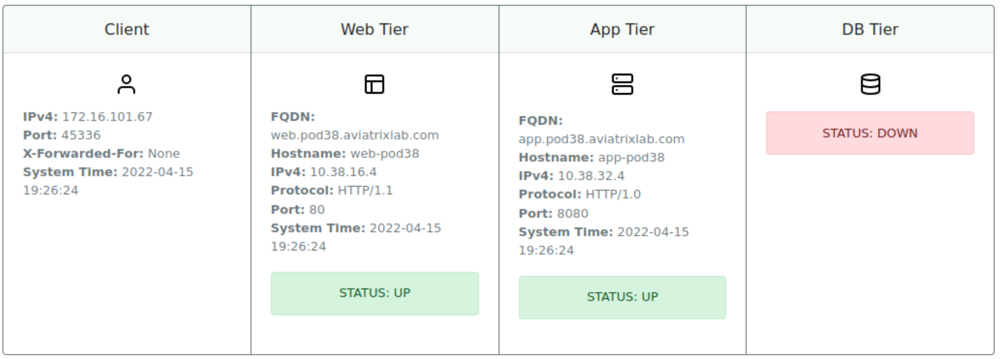
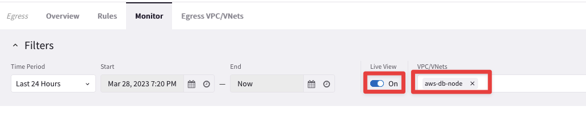
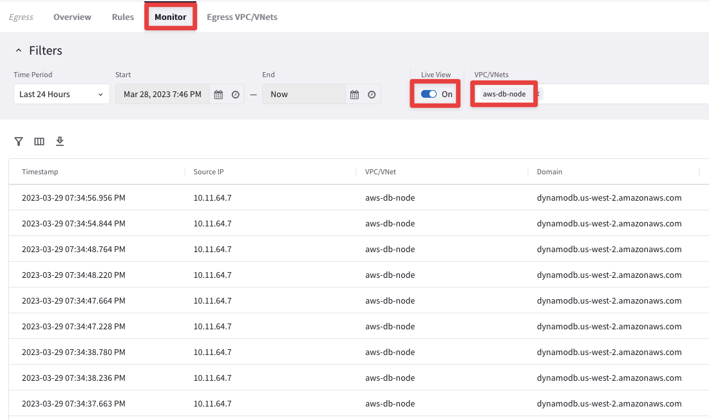
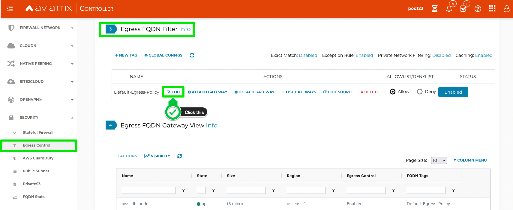
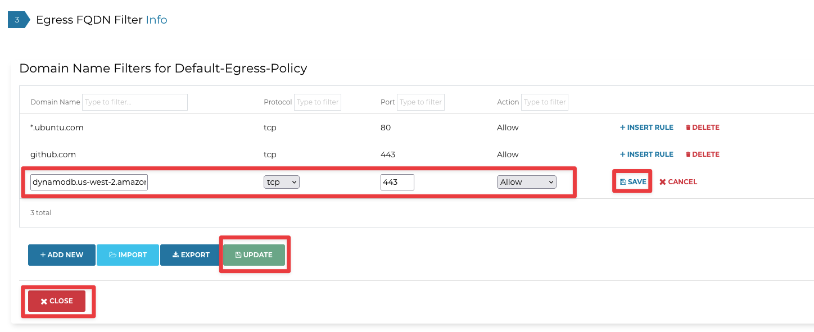
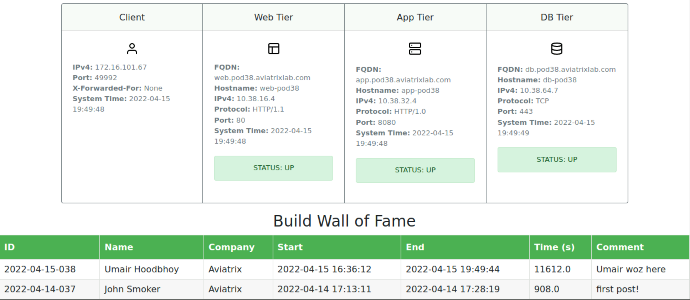

# Lab 2

## Build
Lab time: ~45 minutes

Let’s go build out the connectivity for our app!

```{figure} images/lab1-topology.png
---
height: 400px
align: center
---
Lab Overview
```

## Lab 2.1 - Client / Web Connectivity
### Description
Test Connectivity to Web App  
### Validate

```{hint}
Go to **CoPilot > Diagnostics > Diagnostics Tools**, and select the **azure-web-node** Gateway.
```

```{figure} images/lab2-diag.png
---
align: center
---
Gateway Diagnostics
```

* This provides you with the Network Engineer's toolkit (ICMP-based tools, TCP/UDP connectivity, packet captures) directly from an Aviatrix Gateway
    * Select the `ping` option and launch ping towards the following nodes:
        * client-int.pod**X**.aviatrixlab.com
        * app.pod**X**.aviatrixlab.com
        * db.pod**X**.aviatrixlab.com

```{tip}
Keep the default value for the interface: `"Use Route Table"`.

Click on **Run** for executing the ping command.
```

```{note}
Replace X in the **URLs** with the pod number assigned to you. 

You can view the pod number by accessing the <a href="https://associate-portal.ace.aviatrixlab.com" target="_blank">ACE Associate Lab Portal</a>
```

```{figure} images/lab2-ping.png
---
align: center
---
Lab Overview
```
 
### Expected Results
We have not built any connectivity yet, <ins>so none of the connectivity tests should work yet</ins>.  

## Lab 2.2 - Attaching Spokes
### Description
Attach Spoke VPCs/VNets to their Transits
### Validate
* Open the CoPilot 
* Navigate to **_Cloud Fabric > Gateways > Spoke Gateways_** and edit the Spoke Gateway **_azure-web-node_**

```{figure} images/azure-web-node.png
---
align: center
---
Edit the Azure Spoke Gateway
```

Select the Transit Gateway **_azure-transit_** from the drop-down window from the `"Attach To Transit Gateway"` field, and then click on **Save**.

```{figure} images/azure-transit.png
---
align: center
---
Attach the Spoke to the corresponding Transit GW
```

* Perform these addiitonal actions: 
  * Select _azure-app-node_ and connect it to the _azure-transit_
  * Select _aws-db-node_ and connect it to the _aws-transit-gw_

```{note}
To speed things up, feel free to open multiple browser tabs, and run the **Spoke Attachment** step in each tab
```

```{hint}
You can verify if spokes were correctly attached by viewing notifications. On the top right corner, click on the **_task icon_**, you should see success notifications for the actions you performed above. See an example below:  

```{figure} images/task-icon.png
---
align: center
---
Notifications
```

### Expected Results

Each attachment should take between *30-120* seconds. Check CoPilot Topology to see how the network looks after attaching the Gateways.  

```{note}
Go to **CoPilot > Cloud Fabric > Topology**
```

```{figure} images/attach-topo.png
---
align: center
---
Topology with the Attachments
``` 

## Lab 2.3 - Test the Web App
### Description
Test the Web App
### Validate
* Open the Remote Access Server
* Open **Firefox** from the Desktop on the Remote Access Server
* Navigate to [http://web.pod**X**.aviatrixlab.com]()

```{note}
Replace **X** in the **URL** with the pod number assigned to you. 

You can view the pod number by accessing the <a href="https://associate-portal.ace.aviatrixlab.com" target="_blank">ACE Associate Lab Portal</a>
```

### Expected Results
You should see something similar to this:  
  
_Figure: Web App_

## Lab 2.4 - CoPilot Diagnostics
### Description
Using CoPilot Diagnostics Tools
### Validate
* Go to **CoPilot > Diagnostics > Diagnostics Tools**, and select the **azure-web-node** Gateway.
* Try to ping/traceroute:
    * client-int.pod**X**.aviatrixlab.com
    * app.pod**X**.aviatrixlab.com
    * db.pod**X**.aviatrixlab.com

You should be able to ping successfully both the **APP** Virtual Machine and the **Client** within the DC, thanks to the attachments among the Gateways and the Site2Cloud connection with the remote CSR router.

```{figure} images/lab2-attachment.png
---
align: center
---
Topology with the Attachments
``` 

```{important}
**_There is a huge benefit to owning the data path in the cloud!  You have complete visibility and have the tools needed to troubleshoot and operate your network!_** 
```

### Expected Results
You should see something similar to this:

```{figure} images/lab2-pingok.png
---
align: center
---
CoPilot Ping
```   

```{note}
Since there is no connectivity to AWS, the DB node should not be pingable, due to the absence of the `Peering` between the two Transit Gateways!
```

## Lab 2.5 - FlowIQ
### Description
Using CoPilot **FlowIQ** to debug flows
### Validate
1. Use the left hand search bar within CoPilot to locate **_FlowIQ_** 

```{figure} images/flowiq-screen.png
---
align: center
---
CoPilot FlowIQ
```

Select the **_Records_** tab.

1. Under the `"Filters"` field, click on the **+ symbol** and create the first condition: select **_Destination Port_**, **_equals_** and then port **8080** (traffic from Web to App).

Do not forget to click on **Apply**.

```{figure} images/lab2-plusbutton.png
---
align: center
---
Records
```

```{figure} images/lab2-destination.png
---
align: center
---
Condition
```

2. Click **_Add Condition_** again, make sure to select **_OR_** as boolean condition, select **_Destination Port_**, **equals** and then select port **443** (traffic from App to DB). 

```{figure} images/lab2-addcondition.png
---
align: center
---
Add 2nd Condition
```

```{figure} images/lab2-or.png
---
align: center
---
Two condition with the Boolean OR
```

3. In the **_Time Period_** field, select **Last 60 Minutes**.
2. Add the **_Destination Port_** parameter among the existing columns.

```{figure} images/destination-port.png
---
align: center
---
Destination Port
```

1. Add also the **_TCP Flag Tags_** parameter among the existing columns.

```{figure} images/tcp-flag.png
---
align: center
---
TCP Flag Tags
```

Do not forget to click on **Apply**.

- In the Records tab, you can view the raw flow logs. You should see the `App` (i.e. 10.x.`32`.x) trying to connect to the `DB` (i.e. 10.x.`64`.x) tier, but we only get a **SYN**.

### Expected Results
You should see something similar to this showing successful flows from Web to App, but unsuccessful from App to DB:  

```{figure} images/syn.png
---
align: center
---
Only SYN packet
```

```{note}
No connectivity to the DB tier means that we only see SYN packets, from the APP to the DB. 

Use **FlowIQ** to get insights into all flows running over your secure cloud network.
```

## Lab 2.6 - CoPilot Topology
### Description
Using CoPilot Topology to visualize your secure cloud network.
### Validate

-	Search for **_Topology_**

```{figure} images/lab2-search.png
---
align: center
---
Search field
```

### Expected Results
You should see something similar to this:

```{figure} images/lab2-newtopo.png
---
align: center
---
Topology Overview
```

```{note}
- Azure Spokes are connected to the Azure Transit
- AWS Spoke is connected to the AWS Transit. 

We do not have connectivity between AWS and Azure. Not yet at least!
```

```{important}
**_Visualizing a network can be so helpful!_**
```

## Lab 2.7 - Multicloud Peering

### Description

By this point we should have verified that connectivity in Azure is good, but we are missing the connectivity between Azure and AWS, in order to complete the 3-tier architecture connectivity, among, the APP, the WEB and the DB.

 Aviatrix offers a simple but powerful method for interconnecting clouds.

### Validate

* Navigate to **_Cloud Fabric -> Gateways -> Transit Gateways_** and edit the Transit Gateway **_aws-transit-gw_**, clicking on the pencil icon:

```{figure} images/aws-transit-edit.png
---
align: center
---
Edit Transit Gateway
```

* Select the Transit Gateway **_azure-transit_** from the drop-down window from the `"Peer To Transit Gateways"` field, and then click on **Save**.

```{figure} images/peering.png
---
align: center
---
Establish peering between Transit Gateways
```

## Expected Results
* Verify that the peering has been established 
* Navigate **_Cloud Fabric -> Gateways -> Transit Gateways_** and click on the transit gateway **_aws-transit-gw_**

```{figure} images/aws-transit-gw.png
---
align: center
---
Select the Transit GW
```

* Then select the tab **_Connections -> Transit-Transit peering_**, as depicted below.

```{figure} images/peering-ok.png
---
align: center
---
Transit Peering established
```

```{warning}
You may need to refresh or wait **_60-120 seconds_** for the connection status to become green (UP).
- Check CoPilot Topology to verify the state of the links
```

**Congratulations!!! You have now built a Multicloud Network! Secure cloud networking has never been so easy...**

```{figure} images/peering-ok2.png
---
align: center
---
CoPilot Transit Peering
```

After this lab, this is how the overall topology would look like:

```{figure} images/lab2-final.png
---
align: center
---
Full-blown MCNA: Hub-and-Spoke Topology
```

### Lab 2.8 - Test the Web App
### Description
Check whether the Web App is up and running.

### Validate
* Using the RDP session, open Firefox and navigate to: 

[http://web.pod**X**.aviatrixlab.com]()
* If the site is already open, click the Refresh button

```{note}
Replace **X** in the **URL** with the pod number assigned to you. 

You can view the pod number by accessing the <a href="https://associate-portal.ace.aviatrixlab.com" target="_blank">ACE Associate Lab Portal</a>
```

### Expected Results
You should see something similar to this, meaning the Database is still not accessible!

```{figure} images/webapp-db-down.png
---
align: center
---
DB is still down...
```

## Lab 2.9 - Debug the Egress 
### Description
The database is actually just a **_proxy_** to Amazon DynamoDB. 

Perhaps the proxy cannot reach DynamoDB.

### Validate
* After testing that the connection between Web and App works and seeing that the DB connection fails, verify the Distributed Cloud Firewall section.
* Search within Copilot for **_Egress_**
* Navigate to **_Egress -> Monitor_**
* Select the VPC **_aws-db-node_**

  
_Figure: Egress_  


### Expected Results
* It appears that the Egress filter is not allowing access to:  **_dynamodb.us-west-2.amazonaws.com_**
* You should see somethiing like the following:

  
_Figure: Egress outcome_  
 
## Lab 2.10 - Modify the Egress Rules
### Description
Modify the Egress Rules.
### Validate
1. Open the Controller, navigate to **_Security_** -> **_Egress Control_**
2. Scroll down to **_Step #3 – Egress FQDN Filter_**
3. Click the **Edit** button next to **_Default-Egress-Policy_**


_Figure: Edit Egress Rule_

4. Click **Add New** and enter:
    * **Domain Name:** `dynamodb.us-west-2.amazonaws.com`
    * **Protocol:** `tcp`
    * **Port:** `443`
    * **Action:** `Allow`
    * Click **Save** and then **Update**


_Figure: Add Egress Rule_ 

### Expected Results
You should have seen **Allow** entries for **_*.ubuntu.com_** and **_github.com_**.  After adding an entry for **_dynamodb_**, your Web App should be working.  

## Lab 2.11 - Sign-in to the Web App
### Description
Now that we have built the connectivity, our Web App should be up and running.

### Validate
* Log in to the Remote Access Server
* Open Firefox on the Desktop and navigate to: [http://web.pod**X**.aviatrixlab.com]()

```{note}
Replace **X** in the **URL** with the pod number assigned to you. You can view the pod number by accessing the [ACE Associate Lab Portal](https://associate-portal.ace.aviatrixlab.com)
```

* Click **Sign In**, enter something in the **Comments** and click **Submit** to sign-in to the **WALL OF FAME**

### Expected Results
  
_Figure: DB Tier Working_  

```{note}
You should see that all 3 App Tiers are now up and can talk to each other. You should also be able to register yourself in the form, and also be able to view the Wall of Fame!

**Nice work!** 
```