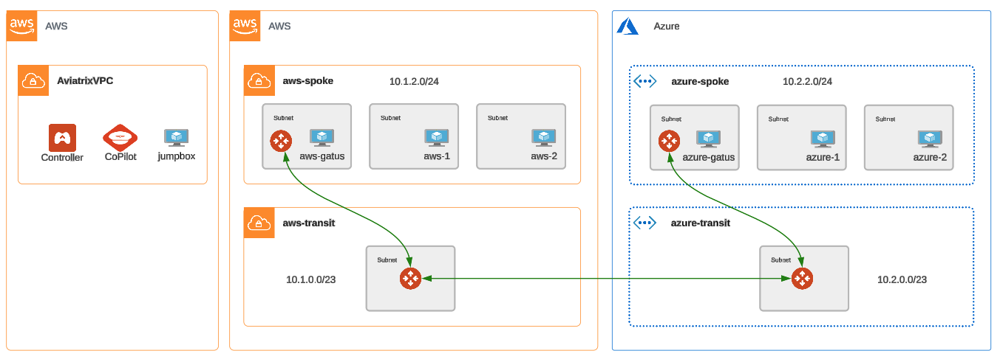
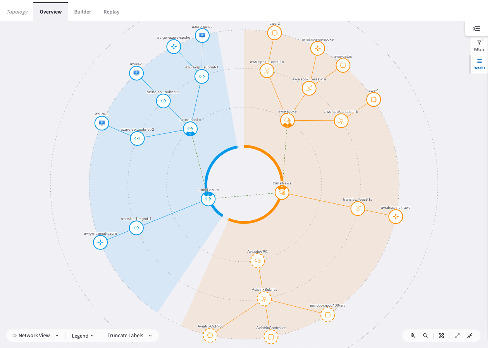
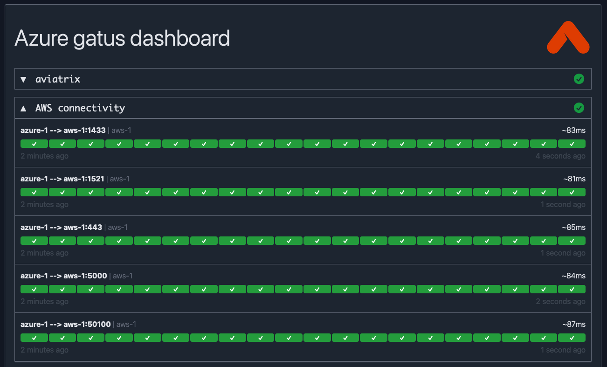

# Multicloud Network Architecture (MCNA)

```{important}
Estimated time to complete: `30 minutes`
```

In this lab, the goal is to bridge two unconnected networks in two separate clouds by implementing a multicloud network architecture (MCNA) using the Aviatrix platform. This will be done solely with the Aviatrix terraform provider.

The following infrastructure will be deployed:

- A transit VPC in AWS
- A transit VNet in Azure
- An Aviatrix transit gateway in the transit vpc in AWS
- An Aviatrix transit gateway in the transit vnet in Azure
- An Aviatrix spoke gateway in the brownfield spoke vpc in AWS
- An Aviatrix spoke gateway in the brownfield spoke vnet in Azure
- Spoke GW attachments to the respective transit GW in each cloud
- A transit-to-transit peering between transit gateways.

In addition to the explicit infrastructure deployed via Terraform, the Aviatrix platform will also handle programming routes into the respective cloud route tables to achieve end-to-end connectivity from spoke VPCs across the deployed Aviatrix transit backbone.

## Initial Connectivity

A reminder of the initial topology of the lab environment:


Also note, the Azure and AWS connectivity sections in your gatus dashboards are `red`.


## Configure and apply

There is no code to configure for this lab. If you look at your `terraform.tfvars` file, the `deploy_mcna` variable is already set to `true`

From your jumpbox or local workstation, navigate to the `ace-automation-ilt` code folder in the `LXTerminal` using the shortcut on the desktop (or shell of your choice or your workstation). On the jumpbox the code is one folder deep.

```bash
cd ace-automation-ilt
```

Then, initialize terraform.

```bash
terraform init
```

Finally, apply.

```bash
terraform apply --auto-approve
```

## Expected Results

In under 10 minutes all the gateways will be deployed and connectivity established. The topology now looks like this:



Looking at the CoPilot Topology view also shows the networks now connected.



Take a look at your gatus dashboards. Did you expect them to change? The inter-cloud connectivity has now moved from `red` to `green`. Instances in AWS can now communicate with Azure and vice versa.



## Code

Let's take a look at the code behind the apply. Looking at the root `main.tf` you can see that the mcna module was executed because `deploy_mcna` was set to `true`.

```terraform
module "mcna" {
  count                      = var.deploy_mcna ? 1 : 0
  source                     = "./mcna"
  backbone                   = local.backbone
  apply_custom_spoke_routing = var.apply_custom_spoke_routing
}
```

Feeding that module, is a local variable that makes up the definition for the transit and spoke vnets/vpcs and their connectivity.

```terraform
locals {
  backbone = {
    aws = {
      transit_name                                 = "transit-aws"
      transit_account                              = "aws-account"
      transit_cloud                                = "aws"
      transit_instance_size                        = "c5n.xlarge"
      transit_cidr                                 = "10.1.0.0/23"
      transit_region_name                          = "us-east-1"
      transit_asn                                  = 65101
      firenet                                      = var.enable_firenet
      firenet_firewall_image                       = "Palo Alto Networks VM-Series Next-Generation Firewall (BYOL)"
      firenet_bootstrap_bucket_name_1              = "${var.pod_number}.bootstrap.aviatrixlab.com"
      firenet_iam_role_1                           = "aviatrix-bootstrap-VM-S3-role"
      firenet_inspection_enabled                   = true
      firenet_keep_alive_via_lan_interface_enabled = true
    },
    azure = {
      transit_name        = "transit-azure"
      transit_account     = "azure-account"
      transit_cloud       = "azure"
      transit_cidr        = "10.2.0.0/23"
      transit_region_name = "West US"
      transit_asn         = 65102
      transit_az_support  = false
    },
  }
}
```

The local mcna module itself consisted of 2 aviatrix modules:

- [backbone](https://registry.terraform.io/modules/terraform-aviatrix-modules/backbone/aviatrix/latest): itself a collection of [mc-transit](https://registry.terraform.io/modules/terraform-aviatrix-modules/mc-transit/aviatrix/latest), [mc-firenet](https://registry.terraform.io/modules/terraform-aviatrix-modules/mc-firenet/aviatrix/latest), and [mc-transit-peering](https://registry.terraform.io/modules/terraform-aviatrix-modules/mc-transit-peering/aviatrix/latest) modules
- [mc-spoke](https://registry.terraform.io/modules/terraform-aviatrix-modules/mc-spoke/aviatrix/latest)

This collection of Aviatrix-supported modules make it very easy to deploy and connect networks across all major cloud providers.

Use the navigation below when you're ready to move onto the next section.
