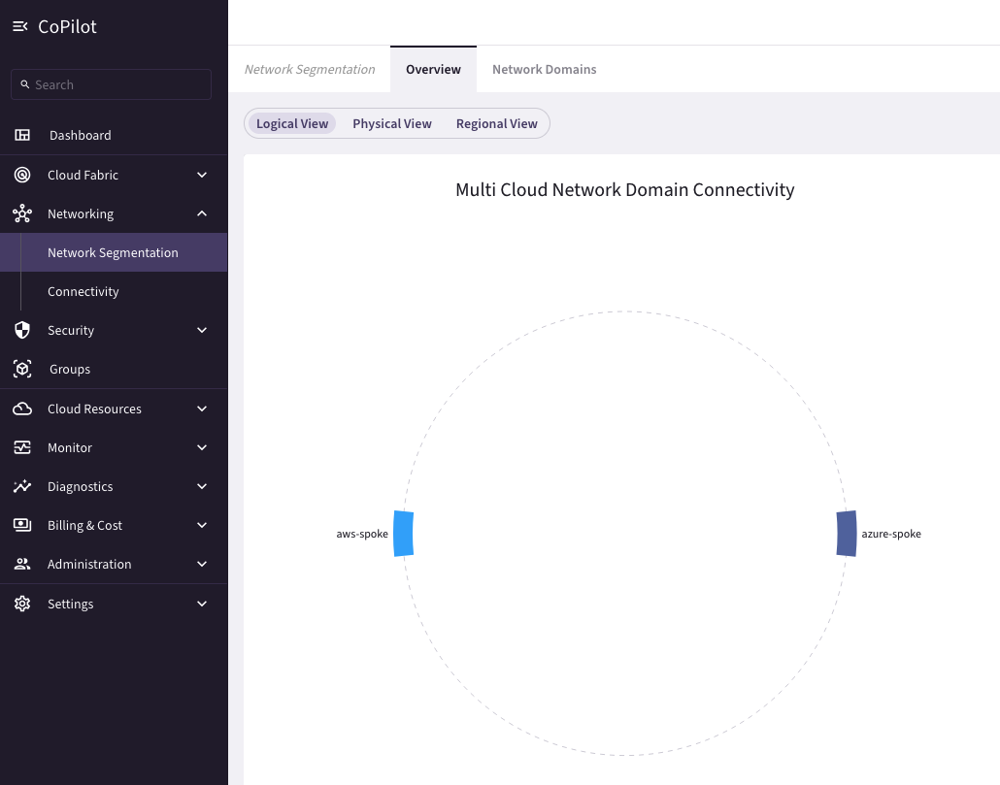
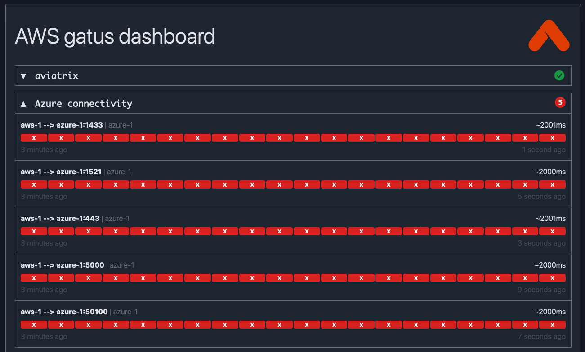
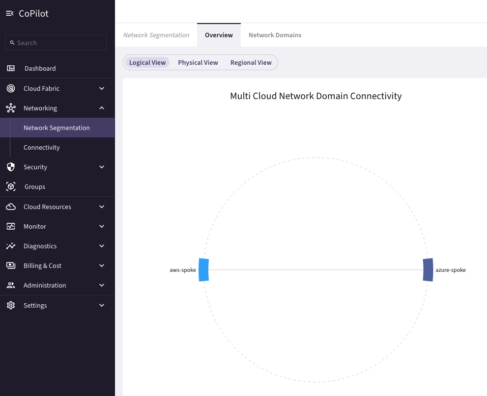

# Network Segmentation

```{important}
Estimated time to complete: `15 minutes`
```

In this lab, the goal is segment the two spoke networks into their own network domains and then reconnect them via policy. This operates at the spoke level. Think of it as a way to isolate networks that should never connect - prod and development networks, for example.

There is no infrastructure to deploy as this is all Aviatrix configuration.

## Initial Connectivity

We're starting with the connected topology we ended with in the FireNet lab.


As such open connectivity between clouds is established.


In CoPilot, navigate to `Networking` and `Network Segmentation` in the left-hand nav.


Note that there are no network domains configured or applied.

## Configure and apply segmentation

Back to your `terraform.tfvars` file. Update the `apply_segmentation` variable from `false` to `true`.

Then from `LXTerminal` on the jumpbox, issue the following command.

```bash
terraform apply --auto-approve
```

It should only take a minute to apply the network domains to each spoke - `Blue` for AWS and `Green` for Azure.

## Segmentation Results

We've now placed each spoke network in its own network segment.


Refresh your network segmentation screen in CoPilot. You'll now see that each spoke has been defined, but not connected.



Click on `Network Domains` in the top nav. You'll see the domain definitions and associations.


Let's check back in the gatus. As expected, the spokes are now fully isolated. The connectivity exists, but Aviatrix will not route unconnected network domains.



## Configure and apply policy

Back to your `terraform.tfvars` file. Update the `apply_policy` variable from `false` to `true`.

Then from `LXTerminal` on the jumpbox, issue the following command.

```bash
terraform apply --auto-approve
```

It should only take a minute to apply the policy to connect the `Blue` and `Green` network domains.

## Policy Results

Back to CoPilot, refresh the `Network Domains` page. You should now see that the domains are now connected.


Clicking on `Overview` on the top nav you'll see it visually.



And, of course gatus is once again reporting connectivity across clouds.


## Code

Let's take a look at the code behind the apply. Looking at the root `main.tf` you can see that the segmentation module was executed because `apply_segmentation` was set to `true`.

```terraform
module "segmentation" {
  count                 = var.apply_segmentation ? 1 : 0
  source                = "./segmentation"
  azure_transit_gw_name = module.mcna[0].transit_azure.transit_gateway.gw_name
  aws_transit_gw_name   = module.mcna[0].transit_aws.transit_gateway.gw_name
  azure_spoke_gw_name   = module.mcna[0].spoke_gw_aws.spoke_gateway.gw_name
  aws_spoke_gw_name     = module.mcna[0].spoke_gw_azure.spoke_gateway.gw_name
  apply_policy          = var.apply_policy
}
```

Inside the local segmentation module, you'll see:

- Definitions for each network domain - `blue` and `green`
- The association between the network domain(s) and their transit and spoke gateways
- The policy connecting the `blue` and `green` network domains

Use the navigation below when you're ready to move onto the next section.
