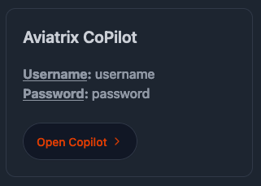
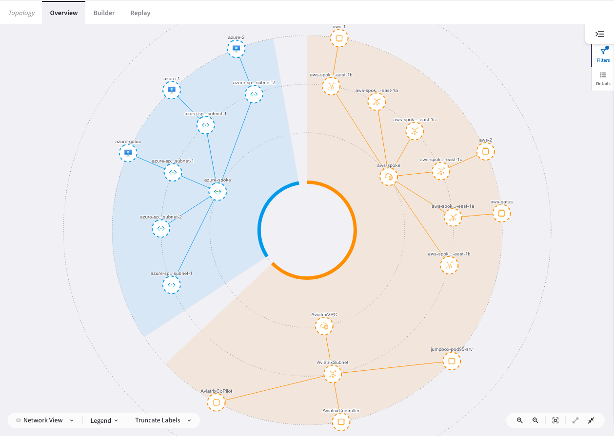
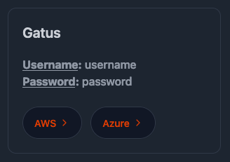
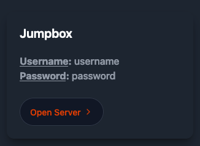
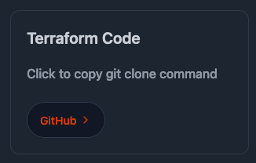
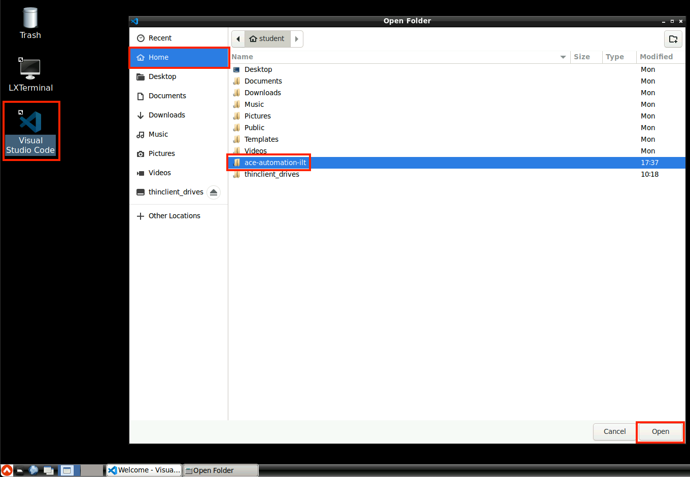
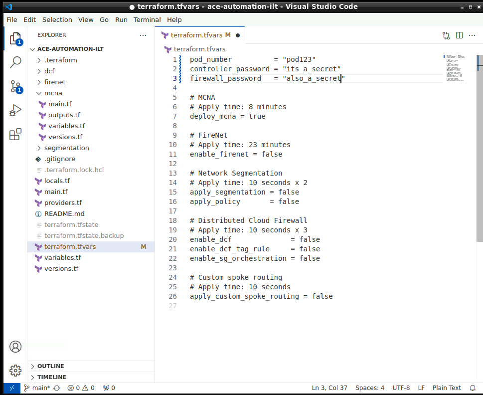
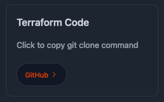
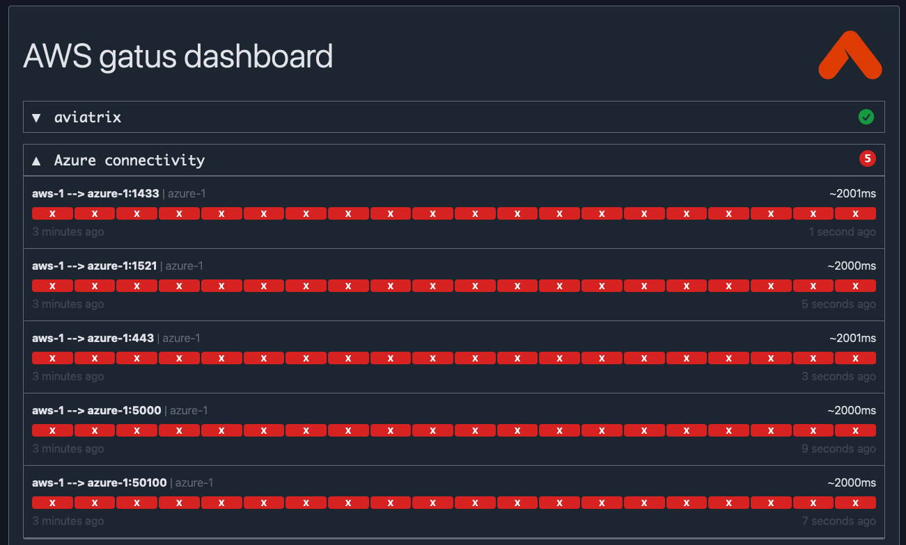
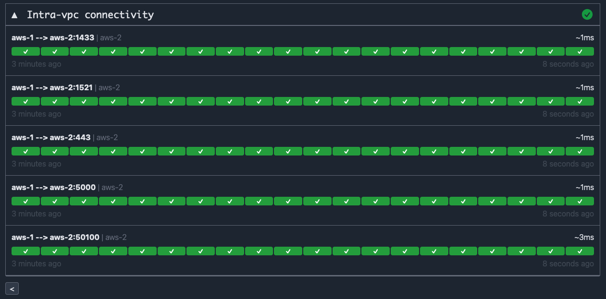

# Getting Started

## Pod Registration

A set of cloud accounts has been reserved for each class participant. What we at Aviatrix call a "POD". To register for your pod, please open the
<a href="https://automation-portal.ace.aviatrixlab.com/" target="_blank">registration portal</a>, enter your details and the access code provided by the instructor. After clicking submit, you will assigned a pod number and given details about the pod; URLs, usernames, passwords, etc to be used throughout the course.

## Initial Topology

Let's take a look at the initial topology deployed to your pod:


Note the 3 VPCs:

- An `Aviatrix` vpc in AWS, containing the Aviatrix Controller, CoPilot, and a jumpbox ec2 to be used as a terraform execution environment with the code for these labs and terraform already installed.
- A spoke VPC in AWS with 3 ec2 instances in their own subnet(s)
- A spoke VNet in Azure wih 3 VMs in their own subnet(s)

## Controller

The Aviatrix Controller is the control plane for your cloud networks. When executing terraform resources using the [Aviatrix Provider](https://registry.terraform.io/providers/AviatrixSystems/aviatrix/latest/docs), it's the Controller api that is orchestrating infrastructure in your cloud accounts and configuration within the Aviatrix platform. In this course, we will only be interacting with the controller via code.

## CoPilot

Aviatrix CoPilot is the management UI for the Aviatrix platform and provides visibility into complex multicloud networks managed by the Aviatrix Controller.



Open CoPilot now with the link and credentials from your pod registration page. Then click `Cloud Fabric` on the left-hand nav and choose `Topology`. You can see CoPilot is already visualizing the infrastructure in your cloud accounts.



## Gatus Dashboards

All of the pre-deployed instances are running [Gatus](https://gatus.io/) and attempting to connect to each other on various ports. There are two gatus dashboard(s), deployed to `aws-gatus` and `azure-gatus`, visualize this connectivity continuously and in real-time. `Green` means a tcp connection was successful and `red` means it was unsuccessful.



The **AWS** gatus dashboard has 3 sections:

- aviatrix: a placeholder that can be ignored
- Azure connectivity: polling connectivity between `aws-1` and `azure-1`
- Intra-vpc connectivity: polling connectivity between `aws-1` and `aws-2`

The **Azure** gatus dashboard has 4 sections:

- aviatrix: a placeholder that can be ignored
- AWS connectivity: polling connectivity between `azure-1` and `aws-1`
- Intra-vpc connectivity: polling connectivity between `azure-1` and `azure-2`
- Spoke routing - custom: polling connectivity between `azure-1` and `aws-1` using a custom internal (to `aws-1`) ip address - `172.16.0.1`

As you move through the labs, you'll refer to the dashboards to see the effect that various configuration has on connectivity. Throughout the lab guide, reference to one (`AWS` or `Azure`) gatus dashboard applies to both.

## Jumpbox

A jumpbox instance has been deployed to act as an execution environment with Terraform and Visual Studio Code already installed should the student require it. It is running [Apache Guacamole](https://guacamole.apache.org/), a clientless remote desktop gateway. It can be accessed via https on the link provided in the portal or via RDP (faster experience) if you have a client and connectivity over port `3389` to the Internet.



```{note}
*Copy and Paste* does not work directly from the jumpbox machine. Activate the **Guacamole Menu**, that is a sidebar which is hidden until explicitly shown. On a desktop or other device which has a hardware keyboard, you can show this menu by pressing **Ctrl+Alt+Shift** on Windows machine or **Control+Shift+Command** on Mac.
```

```{figure} images/start-guacamoleterminal.png
---
height: 400px
align: center
---
Guacamole Menu
```

## Code

The Terraform code we'll be executing for these labs has been pre-installed on the jumpbox in the student home directory, but is also available on GitHub should you prefer to run on your own workstation.



### Jumpbox execution

From the portal registration page, click `Open Server` in the `Jumpbox` section to open the jumpbox in a new tab (or RDP with the client of your choice). Log in with the username and password provided. Clicking the values copies them to your clipboard.

Open Visual Studio Code using the desktop shortcut. Then pull down the `File` menu and click `Open Folder`. Select `Home`, `ace-automation-ilt`, then click Open in the bottom right.



Select the `terraform.tfvars`. This is the only file you will need to modify to perform each lab, setting values from `false` to `true` to enable different use-cases to run. You'll notice at the top, your pod number and passwords have already been populated for you.



You're all set and can skip the next section and move directly to `Expected Results`.

### Workstation execution

Should you choose to use your own workstation to run terraform, version `1.5` is the minimum required.



Clone the code using the link in the portal. Open `terraform.tfvars` in the editor or your choice and modify the first 3 values using your pod registration page. When finished your tfvars should look similar to this:


## Expected Results

In this section we've gotten an overview of the lab environment and its components and gotten the terraform code prepared for execution. Open both AWS and Azure gatus dashboards. Note that the AWS and/or Azure connectivity sections are all `red`. These networks are not connected.



Next, look at the intra-vnet/vpc connectivity and note that everything is `green`. Instances within the vpc/vnet are able to connect on all ports since no microsegmentation has yet been applied.



```{tip}
In the bottom-left of each gatus dashboard, there is a refresh interval. Setting this to the lowest value (10s) helps note changes in connectivity when moving through the labs.
```

Let's connect these clouds! Use the navigation below when you're ready to move onto the next section.
