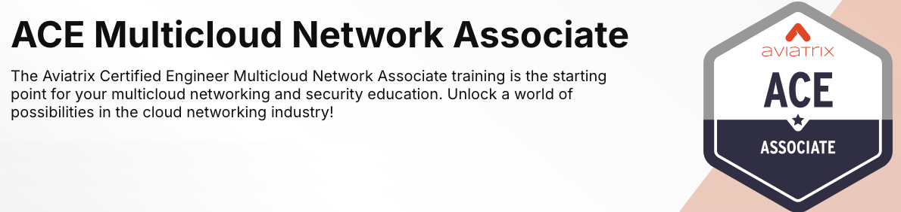
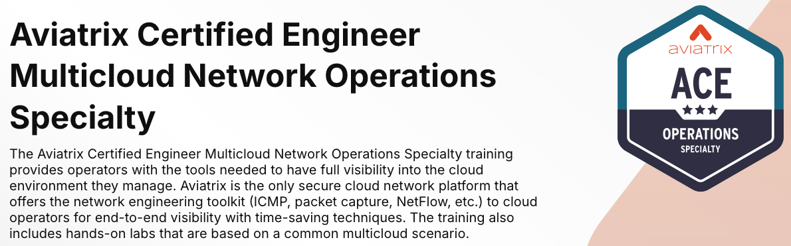
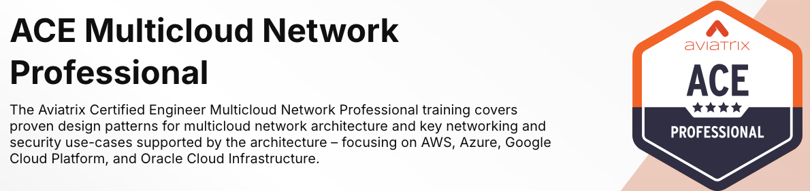

# Summary  

Congratulations, you have completed the ACE Automation instructor led training!  Throughout the labs, we built connectivity across multiple clouds without touching a single CSP route table entry!

We also added network domains and connection policies to segment and connect networks, inserted a 3rd party NGFW, applied custom routing cidrs, and applied distributed cloud firewall rules down to the tag, cidr, and VPC/Vnet.  

Interested in learning more? Look into our [ACE program](https://aviatrix.com/ace/), starting with the self-paced [ACE Associate](https://aviatrix.com/ace-associate/) course. The ACE Associate certification will allow you to take other advanced courses in the ACE Program, such as [ACE Automation self-paced](https://aviatrix.com/ace-automation/), [ACE Operations](https://aviatrix.com/ace-operations/), and [ACE Professional](https://aviatrix.com/ace-professional/).

The ACE Program is the industry’s first and only multicloud networking certification. Its comprehensive trainings and specialized courses provide a deep understanding of how to build, operate, automate, scale, and secure cloud networks across AWS, Azure, GCP, and OCI. The ACE Program equips participants with best practices that span all major cloud providers, regardless of whether they use Aviatrix secure cloud networking.

