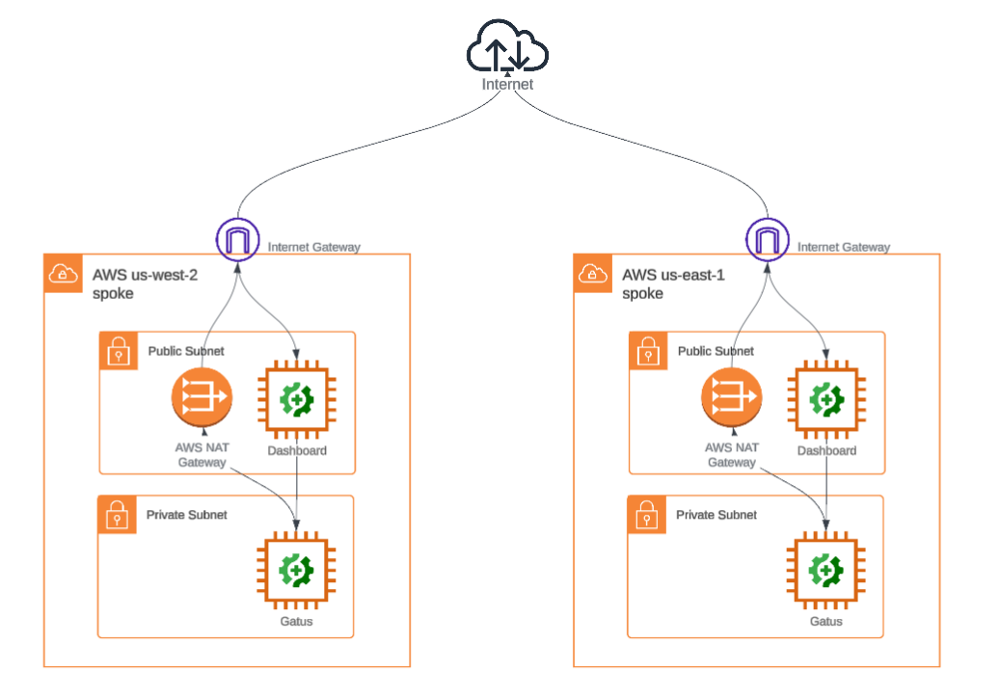
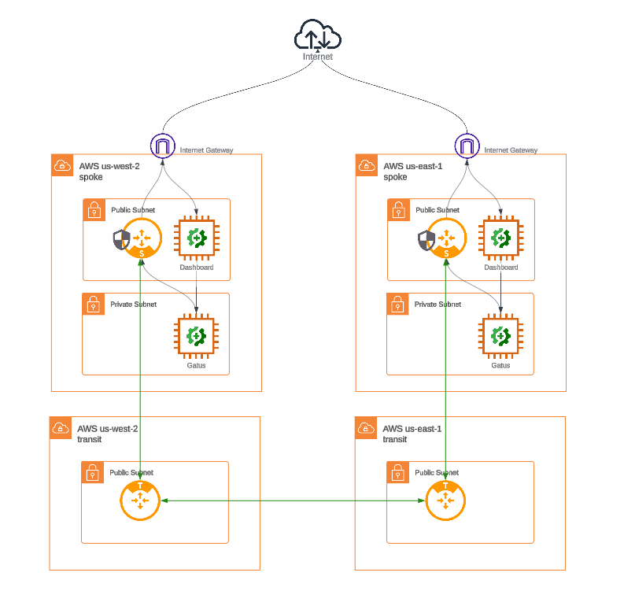
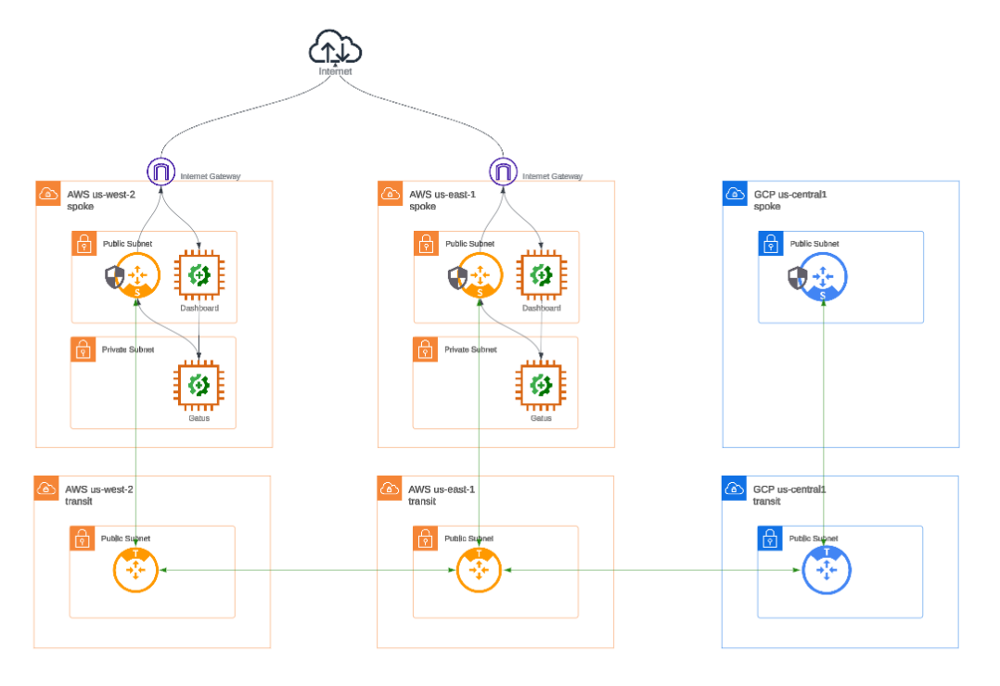

# Introduction

## Summary

The Aviatrix Certified Engineer Multicloud Network Automation Specialty (IaC) course brings the concepts of DevOps together by automating network infrastructure through hands-on labs. Students can expect to enter the training with no coding background and complete the training with an understanding of how to use IaC tools (GitHub and Terraform Cloud) to onboard, monitor, extend, and protect cloud networks at scale using code.

## What is Aviatrix Cloud Native Security Fabric (CNSF)?

Aviatrix Cloud Native Security Fabric (CNSF) is a powerful security solution designed to protect networks across multiple cloud platforms. It gives organizations a centralized way to manage security, apply consistent policies, and monitor activity no matter which cloud providers they are using.

With CNSF, you get built-in tools for zero trust access, threat detection, compliance, and network segmentation. It’s built to work smoothly with your existing cloud setup and helps ensure your multicloud environment stays secure, scalable, and easy to manage.

## Course Format and System Requirements

The ACE Automation Specialty course is in a virtual, self-paced format with lecture content and 4 hands-on labs.

**Duration:** Approximately 4 Hours

### Software Requirements

None. All software is provided by the training environment.

### Prerequisites

- An ACE Associate certificate.
- A [GitHub](https://github.com) account.

### Course Objectives

- Learn how to onboard, monitor, and protect existing cloud networks by deploying the CNSF using the Aviatrix Terraform provider.
- Build a CI/CD pipeline using GitHub actions and HCP Terraform to implement changes to the CNSF based on new security requirements.
- Understand how Security, Networking, and Application teams can all collaborate via code to implement those requirements and reduce friction between those teams.
- Build, extend and protect multicloud networks without prior deep coding or CSP experience by leveraging AI and the Aviatrix Terraform provider.

### Intended Audience

- DevOps Teams
- SecOps Teams
- NetSecOps Teams
- Operations Teams
- Infrastructure Teams

### Network Topology

This course will guide you through the deployment and configuration of the Aviatrix Cloud Native Security Fabric starting with an initial topology of existing networks and workloads:

#### Initial

#### Lab1

`Lab1` will have you onboard and monitor these networks with Aviatrix spoke gateways.

#### Lab2

`Lab2` will have you protect the Internet-bound egress of these networks.

#### Lab3

`Lab3` will have you connect and secure the east-west traffic between these networks.

### Lab4

And finally, `lab4` will have you extend this network to another cloud using code you've developed yourself.

