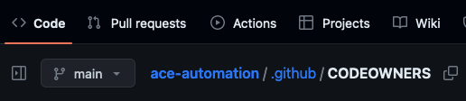

# Code Review

Take a moment to review the code provided by the `ace-automation` repository.

## Lab1

Review the terraform code for lab1:

- `lab1/main.tf` - Deployment of Aviatrix Spoke Gateways via two invocations of the Aviatrix [mc-spoke](https://registry.terraform.io/modules/terraform-aviatrix-modules/mc-spoke/aviatrix/latest) module.
- `lab1/outputs.tf` - Output the details of the spoke gateways for use in lab3.
- `lab1/provider.tf` - Configuration of the [Aviatrix Terraform provider](https://registry.terraform.io/providers/AviatrixSystems/aviatrix/latest/docs)
- `lab1/variables.tf` - Input variables that are provided by the configured `Terraform HCL` variable set
- `lab1/versions.tf` - Backend configuration for `Terraform HCL` and version constraints for the Aviatrix provider and `Terraform`

## Lab2

Review the terraform code for lab2:

- `dcf/main.tf` - Configuration for the Aviatrix Distributed Cloud Firewall (DCF)
- `dcf/provider.tf` - Configuration of the [Aviatrix Terraform provider](https://registry.terraform.io/providers/AviatrixSystems/aviatrix/latest/docs)
- `dcf/variables.tf` - Input variables that are provided by the configured `Terraform HCL` variable set
- `dcf/versions.tf` - Backend configuration for `Terraform HCL` and version constraints for the Aviatrix provider and `Terraform`

## Lab3

Review the terraform code for lab3:

- `lab3/main.tf` - Deployment of two Aviatrix Transit Gateways and their peering through invocation of the [backbone](https://registry.terraform.io/modules/terraform-aviatrix-modules/backbone/aviatrix/latest) module as well as spoke-transit attachments using the `aviatrix_spoke_transit_attachment` resource
- `lab3/provider.tf` - Configuration of the [Aviatrix Terraform provider](https://registry.terraform.io/providers/AviatrixSystems/aviatrix/latest/docs)
- `lab3/variables.tf` - Input variables that are provided by the configured `Terraform HCL` variable set
- `lab3/versions.tf` - Backend configuration for `Terraform HCL` and version constraints for the Aviatrix provider and `Terraform`

## Lab4

[None]

## GitHub Actions

The configuration for GitHub Actions can be found under `ace-automation` > `.github` > `workflows` > `terraform.yml`

Review the comments for details of this configuration. Note that `GitHub Actions` will be triggered for changes inside the `dcf` folder only - on pushes to the `main` branch (merge) or pull requests (any branch).

When `Actions` are triggered for a pull request, a `Terraform Plan` will be executed its results written back to the PR itself.

When `Actions` are triggered for a push to main (merge) a `Terraform Apply` will be executed.

## Codeowners and branch protections

> [!NOTE]
> This section describes `GitHub` code and configuration and is included for reference only. There is no action required.

The repository codeowners file and branch protections are the means by which you can enforce responsibility and collaboration between teams.

Consider the scenario for this lab. The development team for ACE, Inc is responsible for applications deployed in the organization. They are best positioned to understand the egress requirements of their applications. We'll have them communicate those changes by modifying the code directly and creating a PR (more on that below). This will automatically trigger a review by the security team to ensure these changes meet corporate standards of appropriateness. Once the security team approves, the network team can now merge the PR and trigger a workflow that implements the change in the network itself. Communication, collaboration, and implementation are all codifed and enforced by the configuration of the repository.

Review the repository codeowners file located at `ace-automation` > `.github` > `CODEOWNERS`

Read the comments for an explanation of this file. We won't be implementing these rules for this lab, but it's important to understand the concept.

You can read more about the codeowners file by clicking [this link](https://docs.github.com/en/repositories/managing-your-repositorys-settings-and-features/customizing-your-repository/about-code-owners).

Next, let's take a look at branch protections and how they work in tandem with the codeowners file to codify responsibility and collaboration.

Go to your repository and click on `Settings` > `Branches` > `Add branch protection rule`

Set the Branch Name Pattern: `main`

> [!WARNING]
> We won't be implementing these for this course, this is just to understand the concept of codefying collaboration. Applying these settings will inhibit your ability to complete the labs.

If we were working on team, we would check the following 7 fields:

- Require a pull request before merging
- Require approvals
- Dismiss stale pull request approvals when new commits are pushed
- Require review from Code Owners
- Require status checks to pass before merging
- Require branches to be up to date before merging
- Do not allow bypassing the above settings

With these protections in place no one person can makes changes to the network. Additionally, for any Terraform (`*.tf`) code, the Security team will also need to provide an approval to implement changes.
