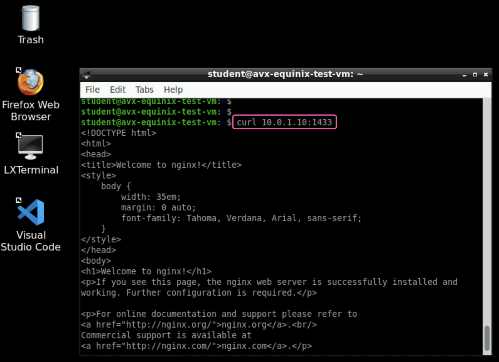
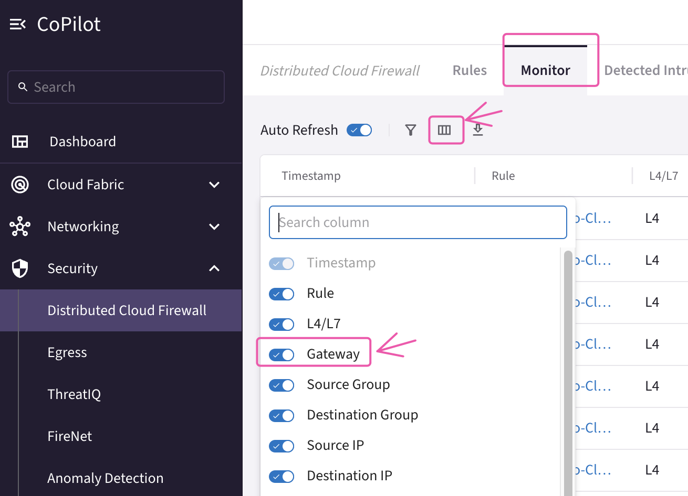
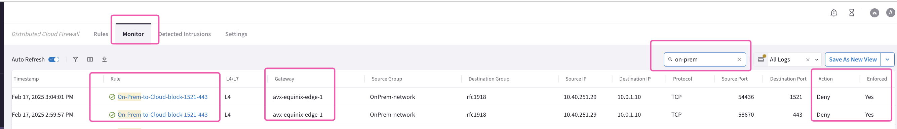

# Lab  SECURE HIGH-PERFORMANCE DATACENTER EDGE
This lab will demonstrate how securely connect on-prem  and Colo locations to CSP.

## 1. General Objectives

You are  asked to interconnect the on-prem DC in New York to your MCNA. An **Aviatrix Edge** device has already been provisioned and it got already registered to the existing **Aviatrix Controller**.

Aviatrix Secure High-Performance Datacenter Edge solution gives power back to the network administrators to deliver cloud connectivity without compromise.  The solution delivers encrypted, line-rate performance with single region, multi region, or multi cloud redundancy options and full visibility and troubleshooting capabilities end to end.

## 2. Initial set-up

Here is a view of the initial topology:
```{figure} images/hybrid-initial.png
---
height: 400px
align: center
---
Initial Topology
```
All applications in AWS and GCP have only **Private** IP’s

These are the CIDR blocks per each CSP:

- AWS = 10.0.1.0/24
- GCP = 172.16.1.0/24

The AWS instance and GCP instance are running several services on the following ports: 1433, 1521, 443, 5000, and 50100.

During the initial setup, MCNA was deployed. Both AWS and GCP environments are connected using the Aviatrix backbone.

## 3. Gatus Dashboards

All of the pre-deployed instances are running [Gatus](https://gatus.io/) and attempting to connect to each other on various ports. There are two gatus dashboard(s), deployed to `aws-gatus` https://aws.pod#.aviatrixlab.com/ and `gcp-gatus`, https://gcp.pod#.aviatrixlab.com/ visualize this connectivity continuously and in real-time. `Green` means a tcp connection was successful and `red` means it was unsuccessful.

```{note}
Above on url replace the **pod#**, with your assigned pod# e.g for **pod97** `aws-gatus` will become https://aws.pod97.aviatrixlab.com/
```
With pre-deployment and initial setup below is the gatus initial sample look


Note that the AWS/GCP and Edge connectivity sections are all `red`. These networks are not connected.
While AWS and GCP connectivity section are all `Green`. As These networks are already connected.

## 4. Edge Connectivity

Edge gateway is already deployed as shown in below topology.


### 4.1. Attachment between Edge and the AWS Transit

Let's establish a peering between the Aviatrix Edge device and the AWS Transit Gateway in **US-WEST-2**. 

In the topology shown below, there is a workstation named "Workstation Edge" connected to the LAN router. Once this connection is made, indicated by the grey links, initiate a ping from the workstation to verify connectivity. In the topology shown above, there is a workstation named "Workstation Edge" connected to the LAN router. Once this connection is made, indicated by the grey links, initiate a ping from the workstation to verify connectivity.


Now it's time to establish Edge Gateway to AWS Cloud attachment! 

Go to **CoPilot > Cloud Fabric > Hybrid Cloud > Edge Gateways** and click on the `"Manage Gateway Attachment"` button, on the right-hand side of the screen.


Click on the `"+Attachment"` button.


Fill in the attachment template using the following settings:

- **Transit Gateway**: <span style='color:#479608'>aws-us-west-transit</span>
- **Local Edge Gateway Interfaces**: <span style='color:#479608'>WAN(etho)</span>
- **Attach over**: <span style='color:#479608'>**Public Network**</span>

Do not forget to click on **Save**.


Wait a few seconds for the Aviatrix Controller to establish the attachment. You will then see a confirmation message like below, indicating that the operation has been successfully completed.


Let's verify the presence of the attachment previously created on the Topology. 

Go to **CoPilot > Cloud Fabric > Topology > Overview (default)**.


### 4.2. Attachment between Edge and the Local Lan Router

Now it's time to establish Edge Gateway to Local Lan Network 

Go to **CoPilot > Networking > Connectivity > External Connections(S2C)** and click on the `"+External Connection To"` and select `"External Device"`


Fill in the External Connectivity template using the following settings:

- **Name**: <span style='color:#479608'>Edge-Onprem-Lan</span>
- **Connect Using**: <span style='color:#479608'>BGP</span>
- **Type**: <span style='color:#479608'>LAN</span>
- **Local Gateway**: <span style='color:#479608'>avx-equinix-edge-1</span>
- **Remote ASN**: <span style='color:#479608'>64900</span>
- **Remote LAN IP**: <span style='color:#479608'>10.40.251.1</span>
- **Local LAN IP**: <span style='color:#479608'>10.40.251.2</span>

Do not forget to click on **Save**.
Wait a few seconds for the Aviatrix Controller to establish the attachment.
Let's verify the presence of the LAN attachment previously created on the Topology. 

Go to **CoPilot > Cloud Fabric > Topology > Overview (default)**.


The On-Prem Edge device is now connected to both the local LAN and the cloud.
By default, the Edge device advertises all cloud routes to the LAN router and all LAN routes learned from the LAN router to the cloud.
This configuration establishes a path from on-premises to both AWS and GCP.
Connectivity is confirmed on both the GCP and AWS gatus dashboards


This is how the Topology would look like after the creation of the attachment.


The **Edge** device allows to extend all the Aviatrix functionalities to the remote DC!

### 4.3. Attachment between Edge and the GCP Transit
The Aviatrix Edge device is capable to be connected to multiple Transit Gateway.

Let's establish a peering between the Aviatrix Edge device and the GCP Transit Gateway in **us-central-1**. 


Go to **CoPilot > Cloud Fabric > Hybrid Cloud > Edge Gateways** and click on the `"Manage Gateway Attachment"` button, on the right-hand side of the screen.


Click on the `"+Attachment"` button.


Fill in the attachment template using the following settings:

- **Transit Gateway**: <span style='color:#479608'>gcp-central-us-transit</span>
- **Local Edge Gateway Interfaces**: <span style='color:#479608'>WAN(etho)</span>
- **Attach over**: <span style='color:#479608'>**Public Network**</span>

Do not forget to click on **Save**.


Wait a few seconds for the Aviatrix Controller to establish the attachment. You will then see a confirmation message like below, indicating that the operation has been successfully completed.


Let's verify the presence of the attachment created on the Topology. 

Go to **CoPilot > Cloud Fabric > Topology > Overview (default)**.


## 5. Edge as DCF 
The rapid adoption of cloud services has transformed how organizations operate, offering scalability, flexibility, and reduced costs. However, it also introduces new security challenges. Traditional firewalls and security measures struggle to keep up with the dynamic nature of cloud environments. This is where Aviatrix Edge Gateway, functioning as a Distributed Cloud Firewall, makes a significant impact.

Edge Gateway as DCF provide
**Enhanced Security:** Comprehensive protection across multi-cloud and hybrid cloud environments.
**Simplified Management:** Centralized control with a unified security framework.
**Scalability:** Seamless scalability to meet the expanding needs of your cloud infrastructure.
**Operational Efficiency:** Reduced complexity leading to improved agility and reduced operational overhead.

### 5.1 Connectivity from on Prem Network Workstation to Cloud .
Previously, we successfully established connectivity between our On-Prem Network and both AWS and GCP Cloud environments. The topology is as follows:


Let’s launch a connectivity test, from the Workstation “Edge” inside the on-prem network.
You can access the  `workstation Edge` https://edge.pod#.aviatrixlab.com , simply replace the **#** with your assigned pod number.
and login with username as `student`.

You will land on the Desktop of the Workstation Edge and from here launch the `LX Terminal`.

```{figure} ../../ace_pro/docs/images/lab8-newjoe4.png
---
align: center
---
LX Terminal
```

Now execute the **curl** command towards the private IP address of the **aws-instance** instance (**i.e. 10.0.1.10**) and **gcp-instance** instance (**i.e. 172.16.1.10**) on following ports
1433, 1521, 5000, 50100
You will get output similar like below.


Also execute **curl** for https like below


### 5.2 Implementing DCF rules

There is a new security requirement stating that on-premises network workstations must not be able to communicate with the cloud over HTTPS or port 1521.

Go to **CoPilot > Security > Distributed Cloud Firewall** and click on the `+Rule` button.


Fill in the Create Rule template using the following settings:

- **Name**: <span style='color:#479608'>On-Prem-to-Cloud-block-1521-443</span>
- **Source Groups**: <span style='color:#479608'>On-Prem-network</span>
- **Destination Groups**: <span style='color:#479608'>rfc1918</span>
- **Protocol**: <span style='color:#479608'>TCP</span>
- **Ports**: <span style='color:#479608'>1521, 443</span>
- **Action**: <span style='color:#479608'>Deny</span>

Make sure to **Logging** toggle on
Do not forget to click on **Save in Drafts**.


Do not forget to click on **Commit**.


Execute the previously run curl commands which we confirmed earlier that the applications hosted on the cloud are accessible from the On-Prem network.

Next, execute the same curl commands on ports 1521 and 443, where we have deployed the deny rule in Aviatrix DCF.

Observe that the connections from the On-Prem network to the CSP are now timing out.


Connections to CSP on other applications running on ports 1433, 5000, and 50100 remain accessible as before.



Now We can view the Distributed Cloud Firewall (DCF) Monitoring logs by following these steps:

1. Navigate to **CoPilot > Security > Distributed Cloud Firewall**
2. Go to  **Monitor** tab.
3. Click on the `Columns` icon
4. Select `gateway` to include in the displayed columns.



In the search field, type `on-prem` to filter all the logs that match the DCF rule name `On-Prem-to-Cloud-block-1521-443`.



The DCF monitor logs indicate that on-premises to cloud traffic is being blocked in accordance with the DCF rule `On-Prem-to-Cloud-block-1521-443`. This rule is implemented on the Edge Gateway, which is deployed within the on-premises network.