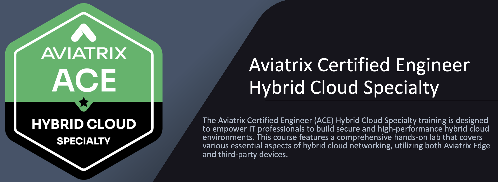

# ACE Hybrid Cloud  

Welcome to the `Aviatrix Certified Engineer Hybrid Cloud` training.

During this session, you will gain knowledge and experience in these areas:

Creating secure and high-performance hybrid cloud solutions for different environments, including:

Secure and High-Performance Hybrid Cloud using Aviatrix Edge for Datacenter/Colocation
Secure and High-Performance Hybrid Cloud using Aviatrix Edge for Equinix
Secure and High-Performance Hybrid Cloud using Aviatrix Edge for Megaport
Secure Hybrid Cloud using 3rd party devices in on-prem data centers and colocations.

## COURSE OBJECTIVE

This course addresses critical pain points in hybrid cloud networking, including:

Lagging Network Security: Traditional datacenter-to-cloud connections often compromise performance and protection.

Visibility Challenges: Lack of centralized visibility across multiple clouds can result in bottlenecks and security risks.

Deployment Delays: Inconsistent configurations can disrupt operations and hinder performance across hybrid networks.

## COURSE BENEFITS

By completing the ACE Hybrid Cloud Specialty course, IT professionals will be equipped to execute fast, consistent configurations with advanced routing and segmentation, ensuring only authorized traffic flows through the system and therefore significantly enhancing both security and performance.

## Key benefits of the Aviatrix solution include:

Programmatic Deployment: Seamless integration with existing environments.
Low-latency Connectivity: Direct connections to global cloud providers.
Fully Encrypted Traffic: Line-rate encryption that meets stringent compliance standards.
Advanced Security Capabilities: Enhanced access control and regulatory compliance.
Operational Consistency: Uniform operations across on-prem and cloud networks.
CUSTOMIZATION AND FLEXIBILITY:Customers can choose Aviatrix on-prem edge devices as virtual or hardware appliances, or they can use third-party routers or firewalls in on-premise locations, allowing for flexibility tailored to their specific network requirements.

