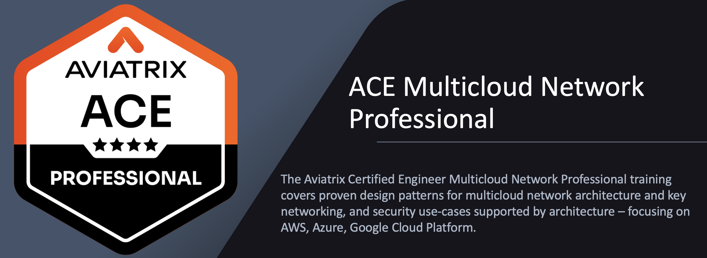

# Welcome to ACE Professional Lab

## 1. Preface

These labs are intended for Aviatrix Customers, Partners, and Employees to aid in the Aviatrix solution learning process. The scope of this document is specifically to cover Aviatrix use-cases configuration steps to design and validate end-to-end Aviatrix functionality.

Unless otherwise mentioned, the lab PODs will be available until **Friday afternoon US Pacific time** the week of the training. In other words, <ins>the pods will be torn down on Friday afternoon</ins>.

## 2. Prerequisites

- The `ACE Associate` certificate is a mandatory prerequisite. 
- At least 1 year of hands-on experience with public cloud platforms, along with an expert-level understanding of VPC, TGW, IGW, VGW, and related concepts in AWS, as well as similar technologies in Azure, is required.  
- (_optional_ for bonus tasks) You should have an `SSH client` installed on your PC and be comfortable using it.
- (_optional_ for bonus tasks) If SSH access from your corporate laptop or desktop is restricted, <ins>please use a personal device without outbound security restrictions (e.g., port 22 must be open)</ins>. 
- You may be asked to share your desktop via `Zoom` during the session, so please be prepared.

## 3. Access Information

This information is provided separately prior to the start of the labs through a dedicated portal:

- Aviatrix CoPilot
- Test Instances in each cloud
- Gatus Application Dashboard
- Bootstrap package information for Palo Alto Firewall (VM-Series) [**Lab 6**]
- StrongSwan Router [**Lab 7**]
- Malicious IP [**Lab 9**]

## 4. Lab Topology

At the start of Day 1 of the class, each student will be given a POD with the following topology.

```{figure} images/home-topology.png
---
height: 400px
align: center
---
Initial Topology
```

By the end of **Day 3**, each student will be able to deploy and verify the following Multicloud Topology, including the following use cases:

- VPC and VNet Creation
- Single Cloud Transit
- CNSF
- Network Segmentation
- High Performance Encryption (aka *Insane Mode*)
- ActiveMesh with High Availability
- Aviatrix Cloud Firewall
- FireNet
- Site2Cloud with Overlapping IPs
- Edge
- Threat Prevention with the special ThreatGroup
- CostIQ
- Distributed Cloud Firewall
- Network Insights API
- IaC with Terraform
- Multi-Tier Transit
- Spoke-to-Spoke Attachment

```{figure} images/home-finaltopology.png
---
height: 400px
align: center
---
Full-Blown MCNA
```

```{note}
Throughout the labs, you will notice some additional pre-configured constructs, which will be utilised in the later labs. Please pay special attention to selecting the right region, gateway or VPC/VNet.

In particular, resources in AWS us-east-1 will not be used until Lab 5. Likewise, resources in Azure west-us-spoke2 will not be used until Lab 7.
```