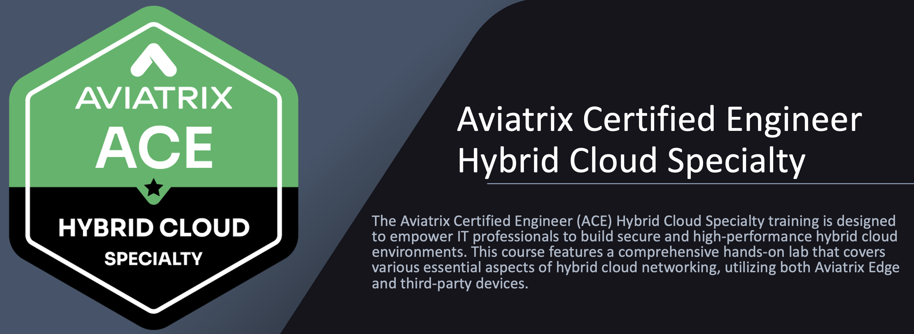
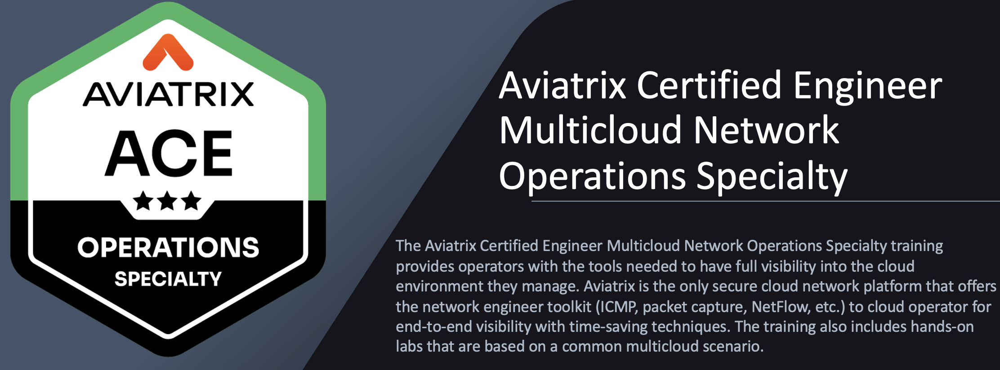
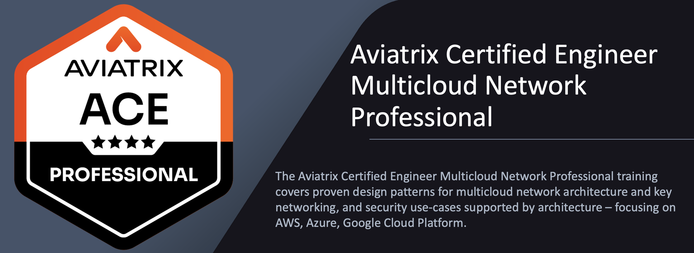

# Summary  

Congratulations, you have completed the `Aviatrix Certified Engineer Multicloud Network Security Specialty` training!

To continue your cloud networking journey, consider the foundational [ACE Associate](https://aviatrix.com/ace-associate/) certification if you haven't already done so. The `Associate` certification will allow you to take other advanced courses in the `ACE` Program, such as [ACE Automation](https://aviatrix.com/ace-automation/), [ACE Backbone](https://aviatrix.com/ace-Backbone/), [ACE Operations](https://aviatrix.com/ace-operations/), and [ACE Professional](https://aviatrix.com/ace-professional/).

