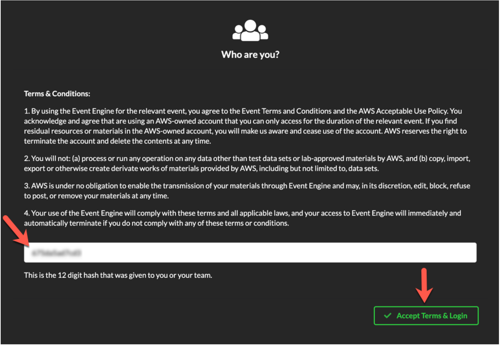
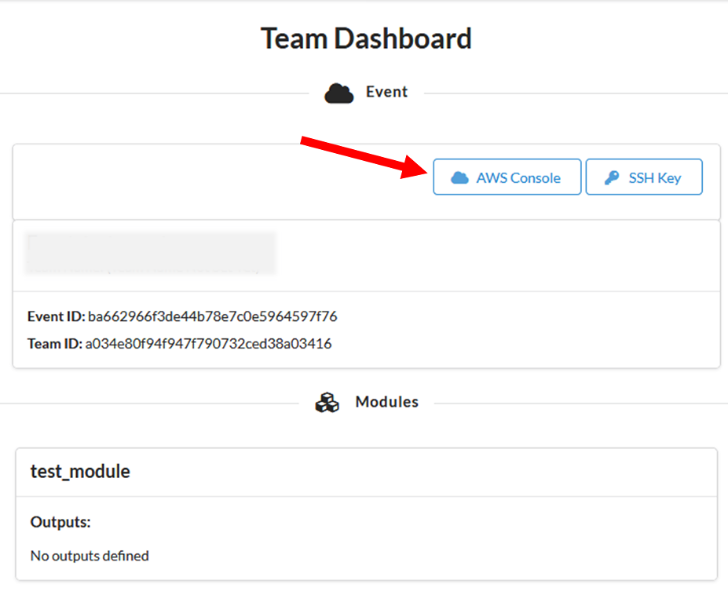
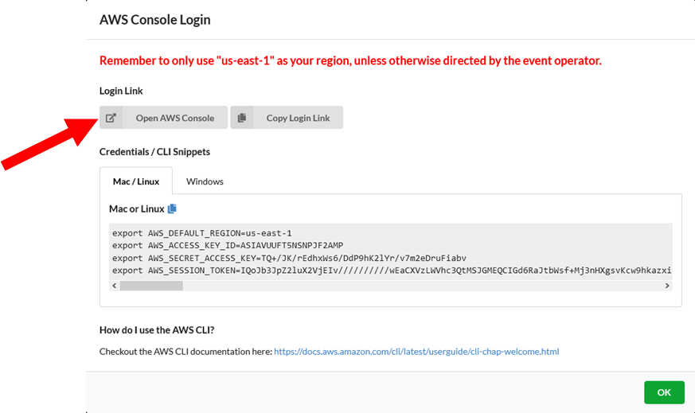

# AWS Event & EventEngine

## Get Started Using the Lab Environment - in an AWS Event, using Event Engine

If you are attending a formal AWS event, you will have been sent a 12-character access code (or `hash`) that grants you permission to use a dedicated AWS account for this workshop. If you have any issues please let your instructor know.

Go to [dashboard.eventengine.run](https://dashboard.eventengine.run/), enter the access code and click Proceed:

  

Click on **AWS Console**, then **Open AWS Console** to login into your dedicated AWS environment.

  
  
